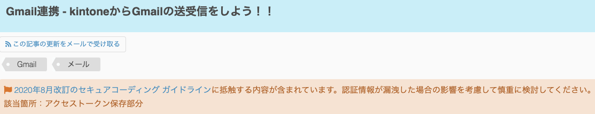
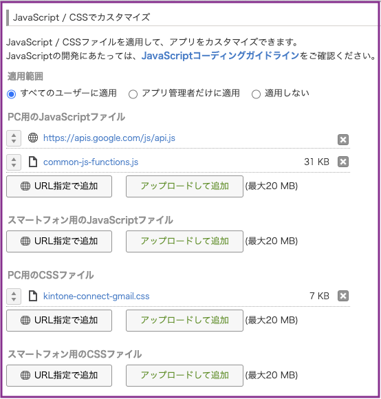
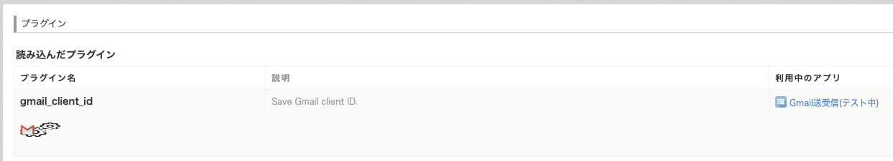
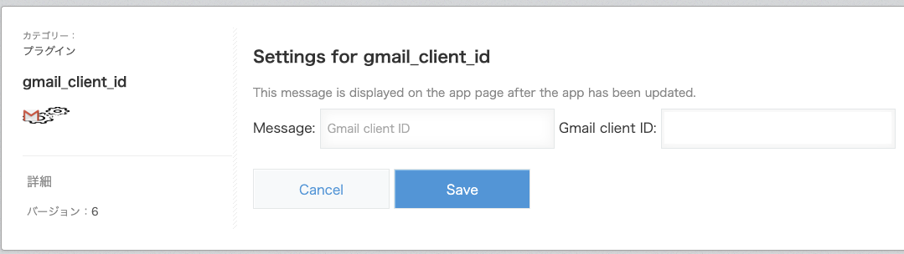
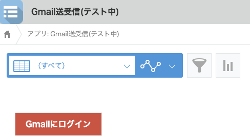
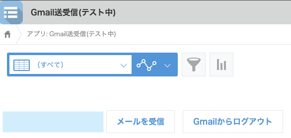

# kintone connect Gmail

> Recieve and send email with Gmail on kintone app

[Gmail連携-kintoneからGmailの送受信をしよう](https://developer.cybozu.io/hc/ja/articles/360000821483-Gmail連携-kintoneからGmailの送受信をしよう-) を試してみようとしたら、ページの上部に下図のように、「[2020年8月改定のセキュアコーディングガイドライン](https://developer.cybozu.io/hc/ja/articles/900001970843)に抵触する内容が含まれている」と *警告* メッセージが表示されている。  



回避方法は、リンク先に簡単に記載されている。  
今回は、 **kintone plug-in** 化し Google app client ID を kintone プラグインのプロキシ API を試してみた。  

## App Customization

> On the _JavaScript and CSS Customization_, add the files following the setting below

[Gmail連携-kintoneからGmailの送受信をしよう](https://developer.cybozu.io/hc/ja/articles/360000821483-Gmail連携-kintoneからGmailの送受信をしよう-) では Google API の Javascript をダウントーどし、アップロードしているが CDN を利用 (URL 指定で追加) した。  

- **Upload JavaScript for PC**
  - google api.js(CDN) `https://apis.google.com/js/api.js`
  - `./common/common-js-functions.min.js`
  - ./js/kintone-connect-gmail.js このファイルは `plug-in` としたので不要

  

- **Upload CSS File for PC**
  - [kintone-connect-gmail.css](./css/kintone-connect-gmail.css)

**Setting**:

[Gmail連携-kintoneからGmailの送受信をしよう](https://developer.cybozu.io/hc/ja/articles/360000821483-Gmail連携-kintoneからGmailの送受信をしよう-) では、 `kintone-connect-gmail.js` の `appClientID` に Google から取得した client ID を直書きするように説明されている。これが冒頭の「セキュアコーディングガイドラインに抵触する」部分なのである。

> Open `kintone-connect-gmail.js`, config the extensions prohibited and the fieldcode of the kintone app

```javascript
app: {
    appClientID: "{App client ID}", // the Google app client ID
    fieldsCode: {
        attachment: "attachment",    // ATTACHMENT field
        bcc: "bcc",                  // SINGLE_LINE_TEXT field
        cc: "cc",                    // SINGLE_LINE_TEXT field
        content: "message",          // RICH_TEXT field
        dateTime: "Date_and_time",   // DATE_AND_TIME field
        from: "from",                // SINGLE_LINE_TEXT field
        labels: "labels_id",         // SINGLE_LINE_TEXT field
        mailAccount: "email_account",// SINGLE_LINE_TEXT field
        messageID: "message_id",     // SINGLE_LINE_TEXT field
        owner: "owner",              // USER_SELECTION field
        subject: "subject",          // SINGLE_LINE_TEXT field
        threadID: "thread_id",       // SINGLE_LINE_TEXT field
        to: "to"                     // SINGLE_LINE_TEXT field
    },
    extensionProhibited: [/*your extensions (seperated with comma)*/] // Example: ['exe', 'csv']
}
```

### convert kintone App to kintone plug-in

#### プラグイン開発準備

kintone のプラグインを開発するために、まず初めに
[プラグイン開発支援ツール群の案内](https://developer.cybozu.io/hc/ja/articles/360000975763-プラグイン開発支援ツール群の案内) の各ツールをインストールした。  
`NODE.js` のパッケージ管理は [yarn 1.22](https://classic.yarnpkg.com/lang/en/) を利用している。

```shell
$ yarn global add @kintone/create-plugin
$ yarn global add @kintone/plugin-packer
$ yarn global add @kintone/plugin-uploader
$ yarn global add @kintone/webpack-plugin-kintone-plugin
$ yarn global add webpack webpack-cli
```

#### プラグイン開発

次のコマンドを実行し、プラグイン開発の初期ファイル群を生成した。
```shell
$ create-kintone-plugin mail
```

Github [SAMPLE-kintone-connect-gmail](https://github.com/kintone-samples/SAMPLE-kintone-connect-gmail) から `js/kintone-connect-gmail.js` を入手する。

そして `js/desktop.js` のコードを `SAMPLE-kintone-connect-gmail/js/kintone-connect-gmail.js` に置き換えて、下記の修正を行った。


Gmail の送受信を行っている `kintone-connect-gmail.js` を

`src/js/kintone-connect-gmail.js` を plug-in 化で施した修正は、以下の `diff` の通り、3行の修正と1行の追加のみである。

```diff
❯ diff --normal src/js/desktop.js ../../../apps/gmail/src/js/kintone-connect-gmail.js
4c4
<  * plug-in: kintone - Mail service
---
>  * App: kintone - Mail service
7d6
<  * Copyright (c) 2020 PCI Thecno
11,13c10
< jQuery.noConflict();
< 
< (function ($, PLUGIN_ID, KC, GAPI) {
---
> (function (PLUGIN_ID, KC, GAPI) {
18d14
<     var conf = kintone.plugin.app.getConfig(PLUGIN_ID);
71c67
<                 appClientID: conf.client_id, /* get from plugin, my google app client ID */
---
>                 appClientID: "", /* Your google app client ID */
1144c1140
< })(jQuery, kintone.$PLUGIN_ID, window.kintoneCustomize || null, window.gapi);
---
> })(kintone.$PLUGIN_ID, window.kintoneCustomize || null, window.gapi);
\ No newline at end of file
```

最初の `4c4` と `7d6` は違いは、ヘッダーコメントである。  
`11,13c10` と `1144c1140` は `jQuery` を利用するための修正。  
`18d14` で plug-in で プラグインの kintone プロキシ に保存した `client ID` などを取り出すコード。  
`71c67` は、 `client ID` を直書きから kintone プロキシに保存した `client ID` を設定している。

#### プラグインの登録

[`@kintone/plugin-packer`](https://developer.cybozu.io/hc/ja/articles/360000910783) を利用してプラグインパッケージを作成する。

`plugin.zip` を [@kintone/plugin-uploader](https://developer.cybozu.io/hc/ja/articles/360000947326) でアップロードする。ログインを二要素認証に設定しているとこのツールは使えない。  
「kintone システム管理 → その他 プラグイン」 を利用すれば良い。 

  
アプリの設定を行ったら、プラグインを登録し、 client ID を登録する。  

  

正しく設定できると  
  
「Gmailにログイン」ボタンが表示される。  

そして認証に成功すると  
  
「メールを受診」ボタンが表示される。  


## Reference

- [Get OAuth client ID](https://developers.google.com/api-client-library/javascript/start/start-js#setup)

## License

MIT License

## Copyright

Copyright(c) Cybozu, Inc.

# get from git

plugin version [SAMPLE-kintone-connect-gmail](https://github.com/mitsuhisaT/SAMPLE-kintone-connect-gmail)  
original [SAMPLE-kintone-connect-gmail](https://github.com/kintone-samples/SAMPLE-kintone-connect-gmail)  
